# FileHub —— 自定义文件托管站

**任意类型的自定义文件**。用「仓库」组织内容，支持星标、评论、搜索、目录层级与下载统计。前端交互动效全部由 **GSAP** 驱动。

  

---

## 界面

截图统一在 1400×900 视口下截取。

### 浏览

首页的方块场由 canvas 手写针孔投影绘制，随光标起伏：

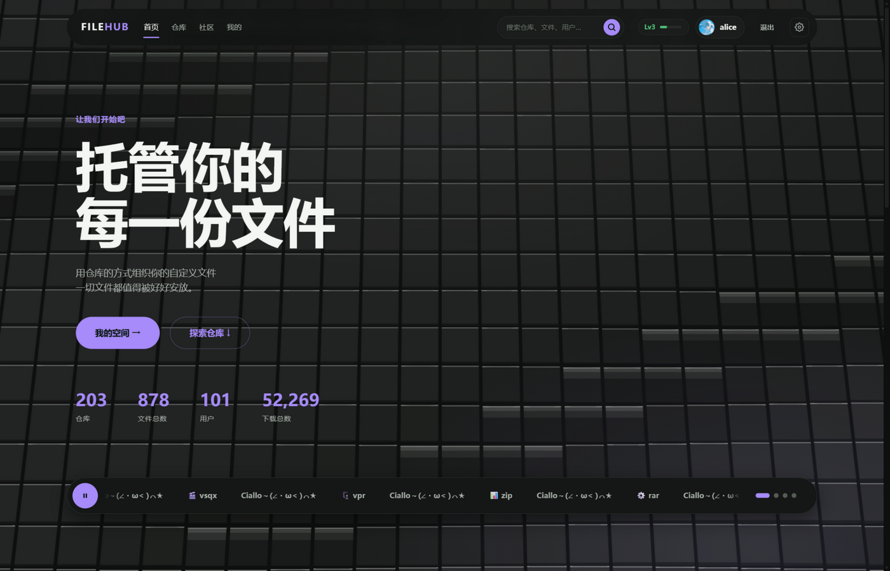

仓库以网格浏览，可按更新 / 星标 / 体积 / 名称排序：

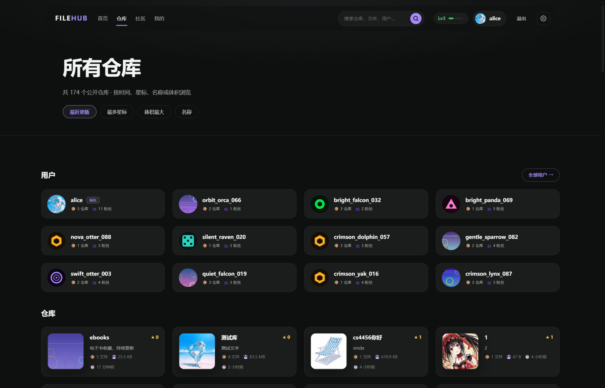

仓库详情：封面、README、带缩略图的文件列表、评论，以及右侧统计面板：

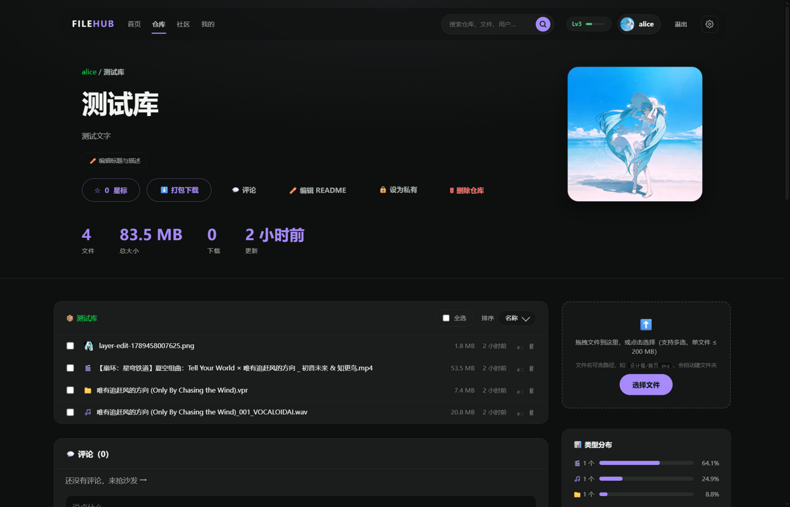

用户主页是「左热力图 + 右简介」两列，背景图可调；全部用户按六列网格排列：

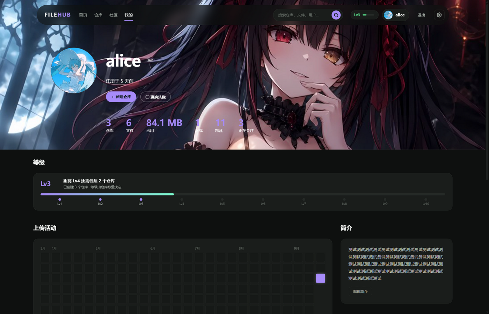

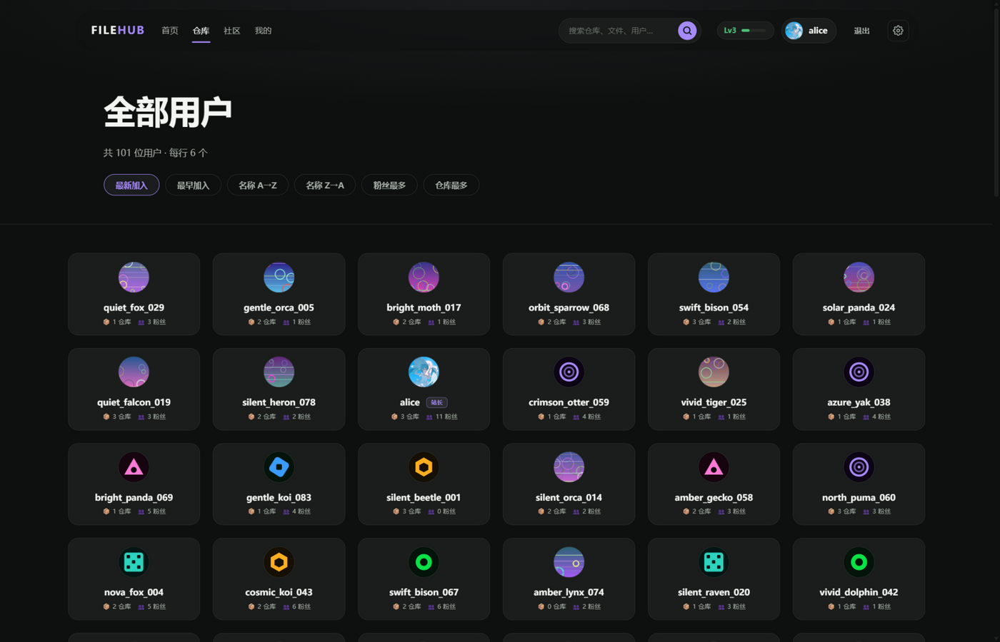

搜索支持输入即出建议、匹配片段高亮与 ↑↓ 选择；社区是单一公共聊天室：

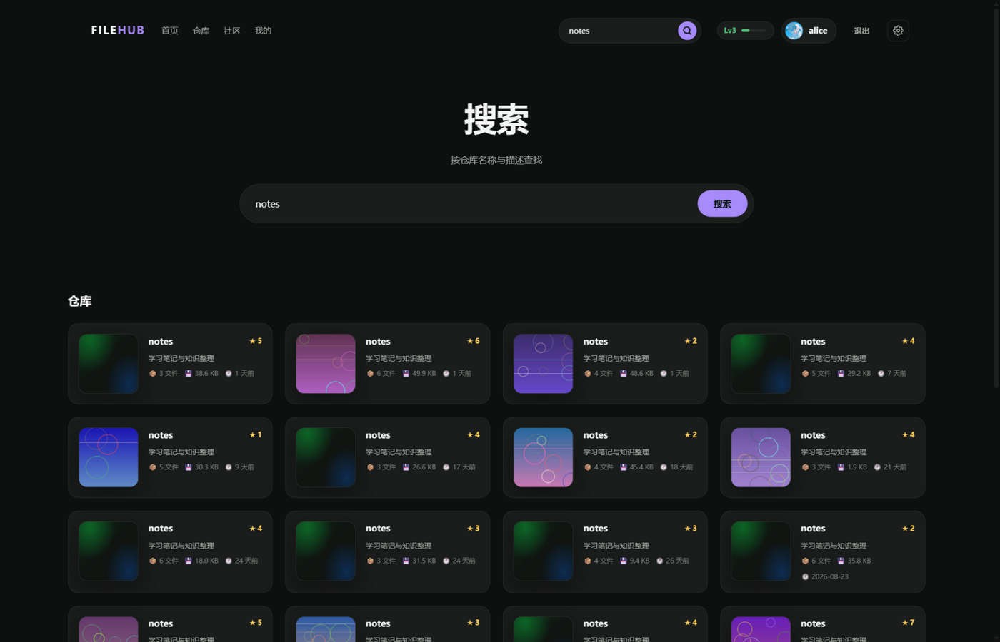

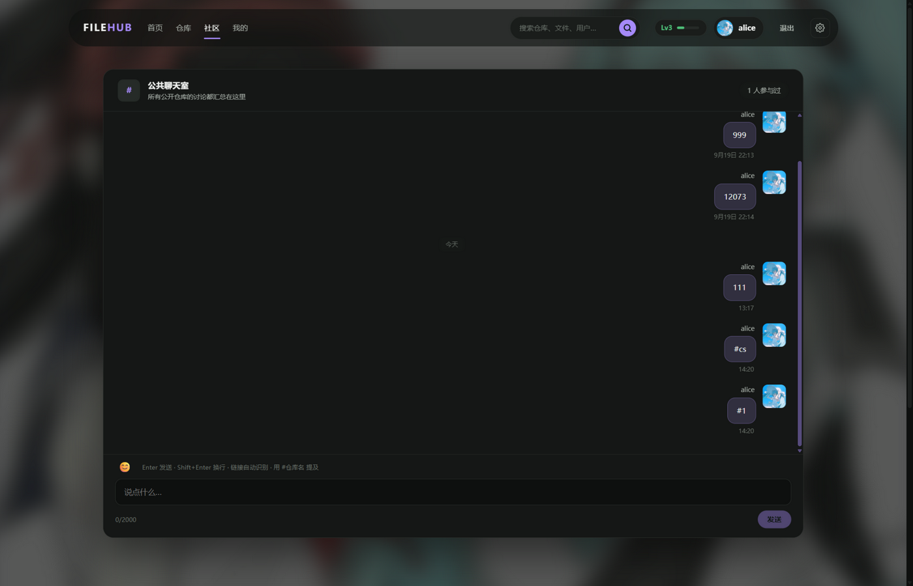

### 账号与编辑

登录与注册站内以弹窗呈现，也可直接访问页面：

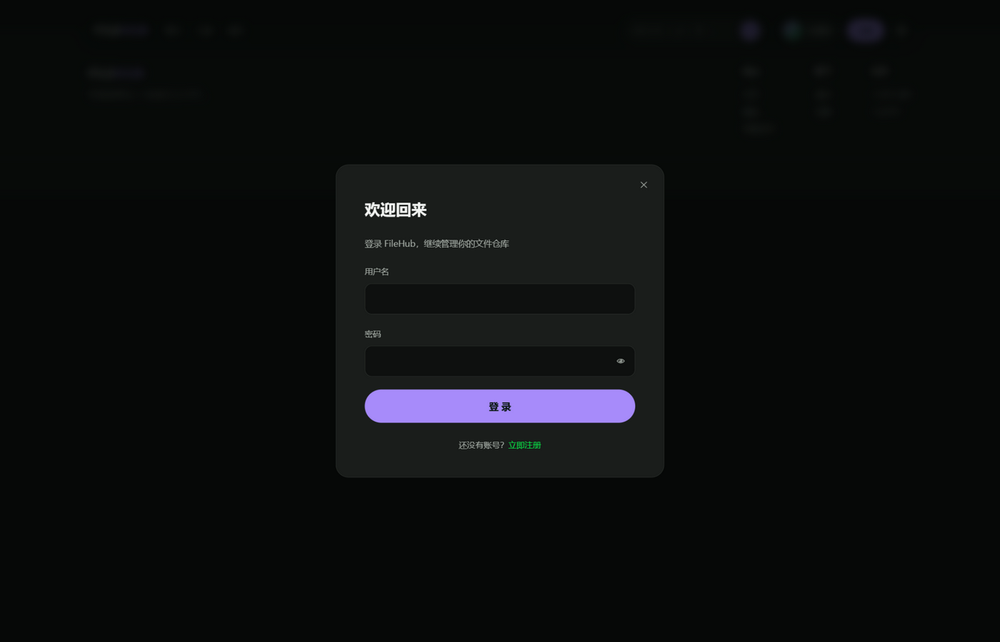

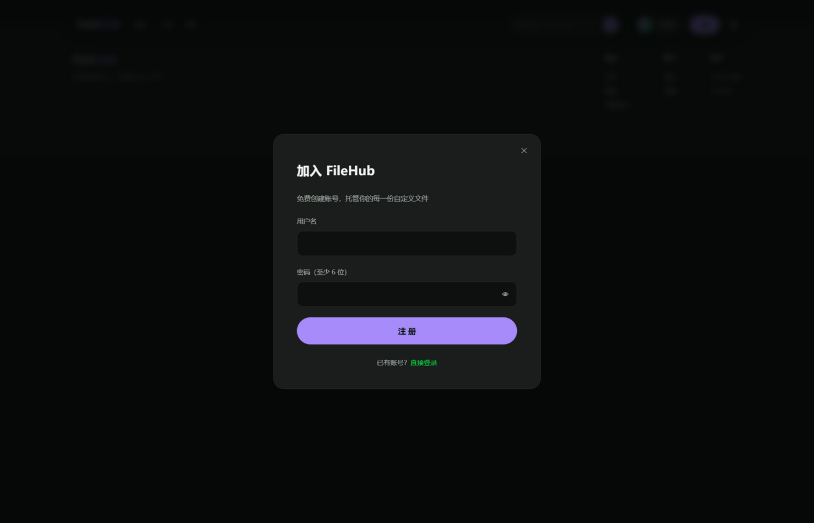

上传头像后进入裁剪页：拖拽选框、四角缩放、滚轮缩放，右上角实时圆形预览：

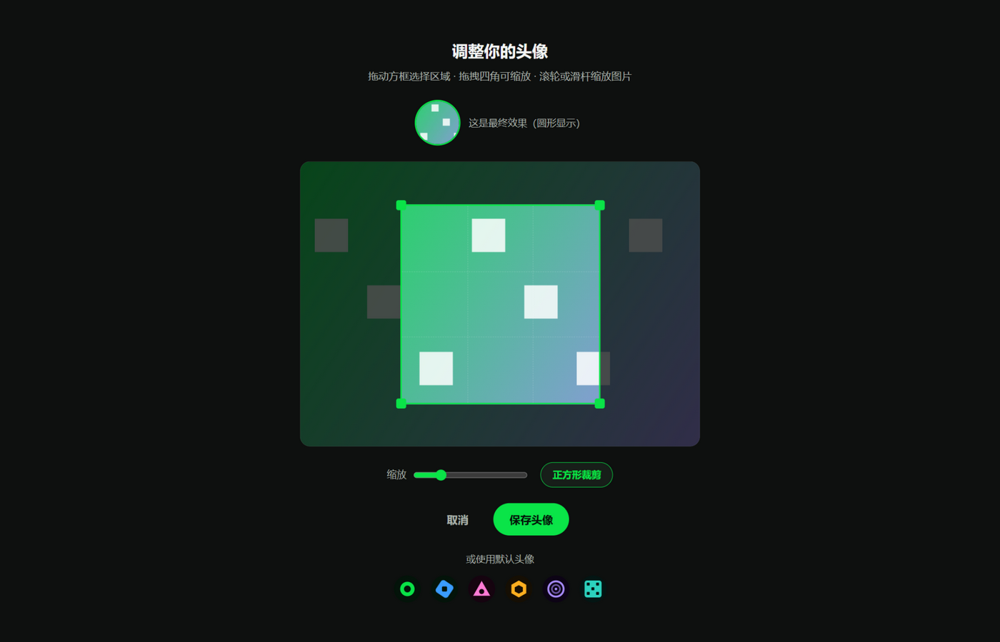

新建仓库与在线编辑 README：

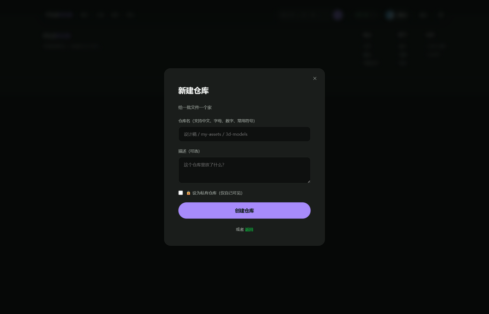

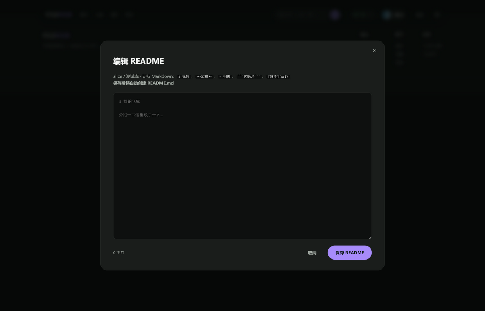

找不到的页面：

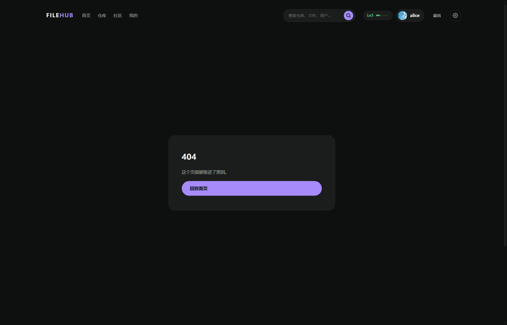

### 站长管理后台

仅站长可开（判定为 `users` 表第一行）。九组计数各画成一根正视 3D 立柱：高度按对数映射，所以 5 条聊天消息和 52269 次下载都能看清；块数只表示量级，精确值仍是旁边的数字。存储健康用立体圆环表示文件构成，底下是磁盘上限。

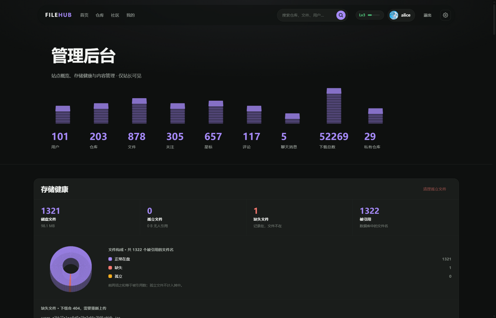

---

## 快速开始

```bash
cd filehub
pip install -r requirements.txt
python server/main.py
```

打开 http://127.0.0.1:8000 即可。Windows 双击 `start.bat`，macOS/Linux 执行 `./start.sh`。

服务跑在前台：**启动后不要关那个终端窗口**，关掉服务就停了（要停止按 `Ctrl+C`）。改动模板、CSS 或 JS 后，浏览器里按 `Ctrl+F5` 强制刷新，否则看到的是缓存的旧页面。

`start.bat` 必须是 **纯 ASCII + CRLF 换行**。cmd 用系统 OEM 代码页读取批处理文件，UTF-8 的中文注释会被解成乱码并当作命令执行，还会导致 `cd` 不生效（表现为 `python: can't open file 'C:\Windows\System32\server\main.py'`）。改动它时请保持这个约束。

---

## 功能

| 能力 | 说明 |
|---|---|
| **账号体系** | 注册 / 登录 / 退出，PBKDF2-SHA256 加盐哈希（12 万次迭代），HttpOnly Cookie 会话 |
| **头像** | 单一入口的菜单：上传图片进入裁剪页（拖拽选框 / 四角缩放 / 滚轮缩放，实时圆形预览）、直接选用内置头像、或移除。服务端统一压缩为 200×200 |
| **仓库式分组** | 每个用户可建多个仓库，含名称、描述、README（Markdown 渲染） |
| **私有仓库** | 一键切换公开/私有，私有仓库对他人返回 404（不泄露存在性），首页/搜索/API/订阅全部过滤 |
| **目录层级** | 上传时文件名可含 `路径/子路径/文件.ext`，自动形成文件夹树，支持面包屑导航 |
| **文件夹别名** | 可给文件夹起中文显示名，实际存储路径不变（不破坏文件结构） |
| **任意文件类型** | 图片 / 视频 / 音频 / PDF / 文本在线预览，其余类型一键下载，单文件上限 200 MB |
| **缩略图** | 图片上传时自动生成缩略图，列表里直接显示小图；损坏图片会优雅降级为类型图标 |
| **整仓打包下载** | 一键把整个仓库（含文件夹结构）导出为 zip |
| **批量操作** | 全选 / 多选文件后一次性删除，带确认弹窗 |
| **删除保护** | 删除文件或整个仓库前弹二次确认，说明后果 |
| **星标** | 一键点星，计数实时更新，带粒子迸发动效 |
| **标签与备注** | 给文件打标签、写备注，标签可在搜索结果中直接看到 |
| **评论** | 仓库下发表评论，登录后可用，零刷新插入并带动画。悬停自己的评论显示编辑/删除按钮，**只有作者能改删**（服务端校验，越权返回 403） |
| **搜索** | 按仓库名称、描述与用户名检索（结果页只列仓库）。输入即出建议下拉，匹配片段高亮，支持 ↑↓ 键选择、回车跳转 |
| **排序** | 文件列表可按名称 / 大小 / 时间排序，使用 Flip 做位移动画 |
| **统计面板** | 仓库侧栏显示文件类型分布（图片/文档/视频占比）与详细信息 |
| **活动热力图** | 个人页展示最近半年的上传活动 |
| **在线编辑 README** | 直接在网页里写 Markdown 并保存，自动创建 README.md |
| **RSS 订阅** | 每个仓库一个 RSS feed，可订阅更新 |
| **JSON API** | `/api/repos` 列出公开仓库，`/api/repos/{owner}/{name}` 返回仓库详情与全部文件 |
| **关注** | 可关注/取关其他用户；粉丝数与正在关注数可点击，弹出完整用户列表；禁止关注自己 |
| **默认头像** | 内置 6 个几何风格 SVG 头像（纯矢量、无外部依赖），与上传头像共存，"preset:N" 标识存储 |
| **导航** | 首页 / 仓库 / 社区三栏，当前页高亮下划线；仓库页支持按更新/星标/体积/名称排序 |
| **社区（公共聊天室）** | 微信风格的单一公共聊天室：引用回复、链接自动识别、60 个表情、消息时间精确到分钟、日期分隔条、自己的消息靠右显示、参与者计数 |
| **仓库封面** | **上传自定义图片**（JPG / PNG / GIF，单张 ≤ 10 MB），服务端自动居中裁剪为 480×480 正方形并压缩；仓库详情页封面嵌入 hero 区为正方形右对齐，列表卡片采用「左封面 + 右信息」两列布局。没有上传时使用内置渐变（极光绿等 6 种），可随时一键恢复默认 |
| **个人主页** | 上下两块：顶部为头像 / 简介 / 6 项统计（同一水平线，含粉丝与正在关注，可点击查看名单并直接关注），下方为**左热力图 + 右简介**两列；支持上传**自定义背景图片**并可视化调节大小 / 位置 / 不透明度 |
| **弹窗式表单** | 登录与新建仓库以弹窗呈现，点击遮罩或按 Esc 关闭 |
| **设置面板** | 齿轮入口的侧边抽屉：动效开关、鼠标跟随、平滑滚动、缩略图、紧凑列表、**5 种强调色**（全站联动）、**整体缩放 60%–100%（默认 80%）**、默认排序，一键恢复默认 |
| **首页鼠标跟随** | 参考 specia1ne 的几何跟随风格：光环、圆点、旋转方块与十字准星以不同阻尼追随光标，
背景网格与色块产生视差，点击有涟漪扩散 |
| **管理后台** | 站长专属的 `/admin`：站点概览、**存储健康对账**（孤立文件可一键清理，缺失文件列出明细）、用户 / 仓库 / 评论三张表各自搜索与分页。权限判定为 `users` 表第一行，非站长与未登录一律跳回首页 |
| **数据可视化** | 概览的九组计数各画成一根正视 3D 立柱，高度按对数映射（跨五个数量级仍可分辨）；存储健康画成立体圆环表示文件构成。均为 canvas 手写针孔投影，不引入图形库 |
| **磁盘上限** | 默认 1 TB，站长可在后台直接修改并即时生效。上传按**磁盘实际占用**在流式写入过程中拦截，超出即拒绝并回显原因 |

---

## 演示数据

内置一个种子脚本，可为站点批量生成演示内容：

```bash
python seed.py        # 100 个用户（默认）
python seed.py 20     # 指定数量
```

它会创建用户、仓库、文件、关注关系、星标和评论，并为每个仓库生成真实的
小文件，因此下载与打包功能都可直接使用。所有生成的账号密码统一为
`demo1234`，用户名形如 `swift_fox_001`。

脚本使用固定随机种子，重复运行不会产生重复数据（已存在的用户名与文件路径会跳过）。

---

## 技术栈

- **后端**：FastAPI + SQLite（标准库 `sqlite3`，无 ORM）+ Jinja2 服务端渲染
- **图像**：Pillow（头像裁剪、缩略图生成；无 ffmpeg 依赖，视频缩略图自动降级）
- **存储**：文件落盘到 `uploads/`，以 UUID 重命名避免路径穿越与重名冲突
- **前端**：原生 HTML/CSS/JS + GSAP 3.15.0（本地 `static/vendor/gsap/`，无需联网）

数据库 `filehub.db` 与 `uploads/` 会在首次启动时自动创建。**已有数据库会自动迁移**——新增的列（头像、私有标记、标签备注、缩略图）通过启动时的 `migrate()` 就地补齐，不需要删库。

---

## GSAP 动效实现

本项目按 GSAP 官方教程（[gsap.com/resources](https://gsap.com/resources/)）的规范逐条落实，而不是随便加点动画：

| 官方教程要点 | 本项目落地位置 |
|---|---|
| **FOUC 防闪**：CSS 先隐藏，JS 用 `autoAlpha` 亮出，`<noscript>` 兜底 | `.split-hero` 等仅首屏标题预隐藏；其余内容默认可见，避免触发器失效时内容丢失 |
| **`document.fonts.ready` 后再切分文字** | `app.js` 里所有 `SplitText.create()` 都在字体就绪后执行，避免中文字体切换导致换行错位 |
| **`mask` + `autoSplit` + `onSplit`** | Hero 标题逐字上推（chars mask），窗口变化自动重切分 |
| **逐词滚动高亮（scrub）** | `.split-why` 文本块随滚动逐词点亮，关键词标绿 |
| **`ScrollTrigger.batch` 批量入场** | 首页特性卡、仓库卡、文件行错峰淡入上移 |
| **`gsap.matchMedia()` 尊重系统动效偏好** | `prefers-reduced-motion: reduce` 时走纯静态降级路径 |
| **站内动效开关** | 头部 ✨ 按钮，写 `localStorage`，实时重建动画上下文 |
| **`ScrollSmoother` 平滑滚动** | `#smooth-wrapper` / `#smooth-content` 结构；`data-speed` / `data-lag` 做光斑视差 |
| **固定元素必须放在 wrapper 外** | 头部、滚动进度条、预览弹窗均在 wrapper 之外（这是官方明确的陷阱） |
| **`Flip` 做状态位移动画** | 文件列表切换排序时的行位移 |
| **`gsap.quickTo()` 高频跟手** | 主按钮的磁性跟随效果 |
| **`ScrambleTextPlugin`** | 已随包引入，可用于状态文案解码效果 |

所有动画只动 `transform` / `opacity`，UI 过渡统一用 `power*.out`——这两条是官方入门指南里明确的性能与手感建议。

---

## 目录结构

```
filehub/
├── server/main.py              # 全部后端：路由、认证、存储、Markdown 渲染
├── templates/
│   ├── base.html               # 布局：固定层 + smooth-wrapper + 脚本引入
│   ├── index.html              # 首页：Hero 逐字 / 逐词滚动 / 跑马灯 / 卡片
│   ├── repo.html               # 仓库页：上传区 / 文件表 / README / 评论 / 预览
│   ├── login.html  register.html  new_repo.html
│   ├── profile.html  search.html  error.html
├── static/
│   ├── css/style.css           # 深色主题，gsap.com 风格
│   ├── js/app.js               # 全部 GSAP 交互逻辑
│   └── vendor/gsap/            # gsap / ScrollTrigger / ScrollSmoother /
│                               # SplitText / Flip / ScrambleText / Draggable …
├── uploads/                    # 上传的文件实体
├── filehub.db                  # SQLite 数据库（自动生成）
├── requirements.txt
└── start.bat / start.sh
```

---

## 主要接口

| 方法 | 路径 | 说明 |
|---|---|---|
| GET | `/` | 首页：统计 + 最新公开仓库 |
| GET/POST | `/register` `/login` `/logout` | 账号 |
| GET/POST | `/new` | 新建仓库（可勾选私有） |
| GET | `/r/{owner}/{repo}?dir=` | 仓库 / 目录浏览 |
| POST | `/r/{owner}/{repo}/upload` | 多文件上传（支持相对路径，同名覆盖） |
| POST | `/r/{owner}/{repo}/bulk-delete` | 批量删除（JSON `{ids:[…]}`） |
| POST | `/r/{owner}/{repo}/visibility` | 切换公开/私有 |
| POST | `/r/{owner}/{repo}/delete` | 删除整个仓库 |
| POST | `/r/{owner}/{repo}/rename-folder` | 设置文件夹显示名 |
| GET | `/r/{owner}/{repo}/archive` | 整仓打包下载 zip |
| GET/POST | `/r/{owner}/{repo}/readme/edit` | 在线编辑 README |
| GET | `/file/{id}/download` | 下载（计数 +1） |
| GET | `/file/{id}/raw` | 原始内容（供预览） |
| GET | `/media/thumb/{name}` · `/media/avatar/{name}` | 缩略图 / 头像 |
| POST | `/file/{id}/meta` | 更新标签与备注 |
| POST | `/file/{id}/delete` | 删除文件（所有者） |
| POST | `/api/star/{repo_id}` | 切换星标，返回 `{starred, count}` |
| POST | `/api/comment/{repo_id}` | 发表评论 |
| POST | `/settings/avatar` · `/settings/avatar/delete` | 上传 / 移除头像 |
| GET | `/u/{username}` | 用户主页（含活动热力图） |
| GET | `/search?q=` | 搜索 |
| GET | `/api/repos` | 公开仓库列表（JSON） |
| GET | `/api/repos/{owner}/{repo}` | 仓库详情与文件清单（JSON） |
| GET | `/api/stats/{username}` | 每日上传统计（JSON） |
| GET | `/api/suggest?q=` | 搜索联想建议（仓库 / 文件 / 用户） |
| GET | `/api/chat` | 公共聊天室历史（含引用关系） |
| POST | `/api/chat` | 发送消息（可带 `quote_id`） |
| POST | `/settings/banner/upload` · `/settings/banner/remove` | 上传 / 移除背景图片 |
| POST | `/r/{owner}/{repo}/cover` | 上传仓库封面（≤ 10 MB） |
| POST | `/r/{owner}/{repo}/cover/reset` | 恢复默认封面 |
| POST | `/settings/bio` · `/settings/banner` | 保存简介 / 个人页背景 |
| GET | `/api/profile/{username}/{tab}` | 粉丝或正在关注列表 |
| GET | `/api/profile/{username}/bio` | 简介与背景配置 |
| POST | `/api/comment/{id}/edit` | 编辑评论（仅作者） |
| POST | `/api/comment/{id}/delete` | 删除评论（仅作者） |
| GET | `/repos?sort=` | 全部公开仓库（updated/stars/size/name） |
| GET | `/community` | 社区：最新评论 + 热门仓库 + 活跃贡献者 |
| GET | `/settings/avatar/crop` | 头像裁剪页 |

> 关闭站点后重新打开，始终回到首页开屏页；页面内导航不受影响。
| GET | `/feed/{owner}/{repo}.xml` | RSS 订阅 |

---

## 配置

在 `server/main.py` 顶部可调整：

```python
MAX_FILE_SIZE = 200 * 1024 * 1024   # 单文件上限
```

部署到公网前建议：换用 PostgreSQL、把会话表换成 Redis、加上 HTTPS 与 CSRF 防护、并把 `uvicorn` 放在 Nginx 之后。

---

## 已知边界

- 上传使用 XHR 带进度条，但**未做分片续传**，超大文件中断需重传
- 仓库权限目前是「所有者可写、所有人可读」，没有私有仓库
- Markdown 渲染是轻量实现（标题/列表/代码块/链接/加粗），不追求完整 CommonMark
